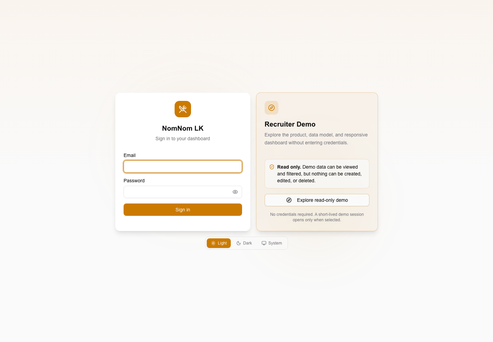
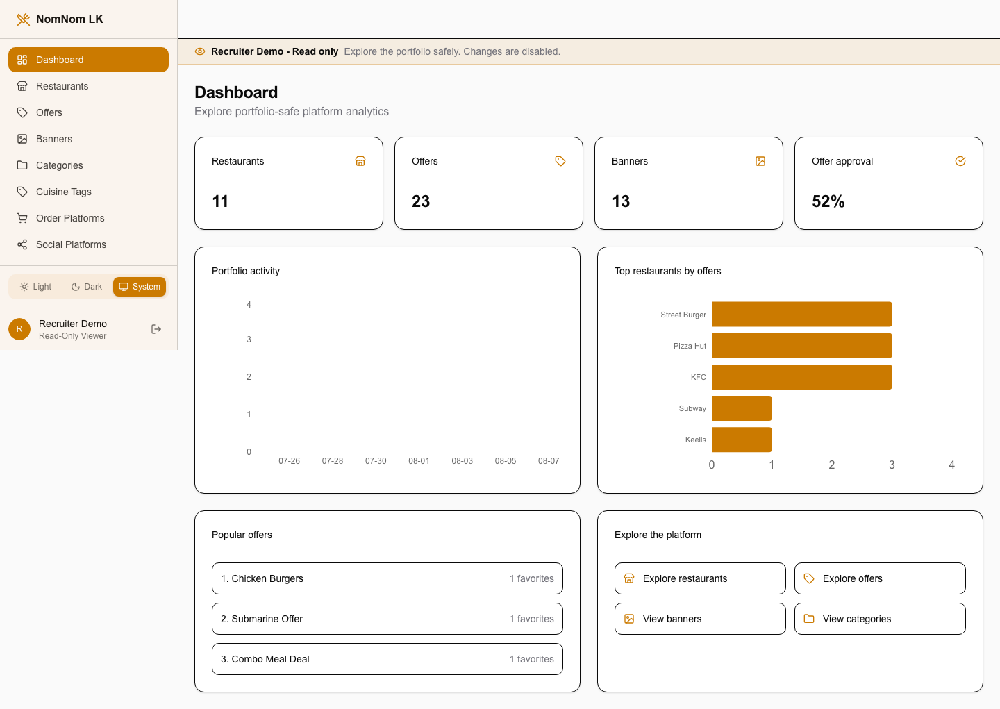

# NomNom LK

[](https://github.com/NamalTharindu97/nomnom-lk/actions/workflows/ci.yml)
[](https://github.com/NamalTharindu97/nomnom-lk/actions/workflows/deploy-staging.yml)

NomNom LK is a full-stack Sri Lankan food-offer discovery platform. Consumers use the Flutter app to discover, search, and save offers. Restaurant owners manage owner-scoped restaurants and offers, while administrators handle approvals, users, banners, notifications, coupons, analytics, audit logs, and platform configuration.

## Recruiter Demo

[**Explore the live read-only dashboard**](https://demo.nomnomlk.com/login)

Open the login page and select **Explore read-only demo**. No credentials are
required. The 30-minute recruiter session can explore portfolio-safe analytics,
restaurants, offers, banners, categories, cuisine tags, and platform
integrations. User accounts, notifications, audit logs, settings, uploads, and
all mutations remain unavailable.

Read-only access is enforced by the Go API through an explicit GET allowlist,
sanitized response mappings, short-lived access-only cookies, a fail-closed
rate limit, and server-side rejection of every mutation method. Hidden dashboard
controls are an additional usability measure, not the security boundary.





## Current Status

The core product and Play Store compliance fixes are complete. Staging is deployed on a Contabo VPS with HTTPS, immutable-image CI/CD, migrated data, Sentry crash reporting, and public legal pages. Current release work is focused on Play Store listing assets, the Data Safety form, and final production promotion.

| Area | Status |
|---|---|
| Integration branch | Protected `staging` |
| Production branch | Protected `master` |
| Logging | Correlated diagnostics with bounded retention and stable host aliases |
| Flutter tests | 344 passing |
| Backend tests | 145 passing |
| Admin E2E tests | 73 passing |
| Staging deployment | Healthy |
| Production promotion | Pending approval |

Recent reliability work includes:

- SSE immediate response flush, 15-second heartbeat, 30-second Flutter timeout, and silent reconnects
- Private favorites, notifications, unread count, and current-user responses excluded from HTTP caching
- Authoritative favorite reconciliation, including empty sets and cross-device removals
- Race-safe favorite toggles, notification persistence, logout, and account switching
- Adaptive Flutter phone layouts, reduced-motion support, and smoother transitions
- Structured backend panic diagnostics and Flutter-to-backend request-ID correlation
- Five-file Docker log rotation with stable `/var/log/nomnom` service aliases

## Live Services

| Service | URL |
|---|---|
| API | <https://api.nomnomlk.com> |
| Admin | <https://admin.nomnomlk.com> |
| Recruiter Demo | <https://demo.nomnomlk.com/login> - select **Explore read-only demo** |
| Privacy Policy | <https://admin.nomnomlk.com/privacy> |
| Terms of Service | <https://admin.nomnomlk.com/terms> |
| Support | <https://admin.nomnomlk.com/support> |
| Account Deletion | <https://admin.nomnomlk.com/delete-account> |

These are staging services until the protected production promotion is completed.

## Technology

| Layer | Stack |
|---|---|
| Mobile | Flutter 3.44, Dart, Provider, Dio, Hive, Firebase Messaging, Sentry |
| Admin | Next.js 16, React 19, Tailwind CSS v4, shadcn/ui, React Hook Form, Zod |
| Backend | Go 1.25, Gin, GORM |
| Data | PostgreSQL 16, Redis 7 |
| Authentication | Firebase Auth and backend JWT |
| Storage | MinIO locally, Cloudflare R2 when hosted |
| Notifications | Firebase Cloud Messaging HTTP v1 |
| Real-time updates | Server-Sent Events |
| Infrastructure | Docker, Contabo VPS, Caddy, Cloudflare, GitHub Actions |

## Repository Layout

```text
.
├── admin/                  Next.js admin and owner dashboard
├── backend/                Go API and local infrastructure
├── lib/                    Flutter application source
├── test/                   Flutter unit and widget tests
├── deploy/vps/             VPS Compose and deployment configuration
├── scripts/                Build and deployment scripts
├── plans/                  Detailed implementation and release plans
├── docs/                   Knowledge base and deployment documentation
├── ARCHITECTURE.md         System design and key decisions
└── AGENTS.md               Current project context and engineering rules
```

See [ARCHITECTURE.md](ARCHITECTURE.md) for the detailed system design.

## Prerequisites

- Go 1.25 with the toolchain declared in `backend/go.mod`
- Node.js 20+
- Flutter 3.44+
- JDK 17 for Android builds
- Docker Desktop or another Docker-compatible runtime
- Air for backend hot reload
- Firebase configuration only when testing Firebase Auth or FCM

## Local Setup

### 1. Start infrastructure

Docker is used locally for PostgreSQL 16, Redis 7, and MinIO only.

```bash
cd backend
docker compose up -d
docker compose ps
```

### 2. Configure the backend

Create `backend/.env` from the repository's local example or documented environment settings. Keep all credentials outside Git.

Firebase Auth and FCM degrade gracefully when local Firebase credentials are absent.

### 3. Seed development data

```bash
cd backend
make seed
```

Development seed accounts must never be reused in staging or production.

### 4. Start the API

```bash
cd backend
make run
```

The local API runs at `http://localhost:8080`.

### 5. Start the admin dashboard

```bash
cd admin
npm install
npm run dev
```

The local admin dashboard runs at `http://localhost:3000`.

### 6. Run Flutter

```bash
flutter pub get
flutter run
```

Android emulators use `http://10.0.2.2:8080/api/v1` as the local API fallback. A compile-time endpoint can be provided when needed:

```bash
flutter run \
  --dart-define=API_BASE_URL=https://api.nomnomlk.com/api/v1
```

## Common Commands

### Backend

```bash
cd backend

make infra              # Start PostgreSQL, Redis, and MinIO
make infra-down         # Stop local infrastructure
make run                # Run with Air hot reload
make build              # Build the API binary
make seed               # Seed local development data
make migrate            # Run tagged migrations
make test               # Run backend package tests
make test-integration   # Run integration tests
make lint               # Run golangci-lint

go test ./...           # Run the complete Go suite
govulncheck ./...       # Check known Go vulnerabilities
```

### Admin

```bash
cd admin

npm install
npm run dev
npm run lint
npx tsc --noEmit
npm run test:unit
npm run test:e2e
npm run build
```

Playwright tests use isolated fixtures from `admin/tests/`. Test credentials must never be accepted by hosted environments.

### Flutter

```bash
flutter analyze --no-fatal-infos
flutter test
flutter test --coverage
flutter gen-l10n
flutter build apk --debug
flutter build appbundle --release
```

After every Flutter source change, rebuild and rerun the app on an emulator or physical device.

## Testing

The protected CI workflow runs on pull requests and pushes targeting `staging` and `master`.

```bash
# Backend
cd backend
go test ./...
go test -tags=integration ./internal/handlers/... -timeout 120s

# Admin
cd admin
npm run lint
npx tsc --noEmit
npm run test:unit
npm run test:e2e

# Flutter
flutter analyze --no-fatal-infos
flutter test
```

CI also performs secret scanning, dependency audits, Go vulnerability checks, coverage uploads, Android App Bundle generation and metadata verification, container builds, and container security scans.

## Git And Deployment Workflow

NomNom LK uses protected `staging` and `master` branches:

1. Create a feature, fix, or phase branch from the latest `origin/staging`.
2. Make the smallest change and run targeted regression tests.
3. Run the relevant complete test and build suites.
4. Push the branch and open a pull request targeting `staging`.
5. Merge only after the required Backend, Admin, and Flutter checks pass.
6. A successful post-merge staging CI run triggers immutable image deployment to the VPS.
7. Verify staging before requesting production promotion.
8. Promote only the exact staging-tested SHA through the protected production workflow and manual GitHub environment approval.

Never push directly to `master`, deploy mutable `latest` images, or rebuild artifacts during production promotion.

Relevant workflows:

- `.github/workflows/ci.yml`
- `.github/workflows/deploy-staging.yml`
- `.github/workflows/promote-production.yml`
- `.github/workflows/rollback-production.yml`

See [deploy/vps/README.md](deploy/vps/README.md) and [plans/production-git-cicd-plan.md](plans/production-git-cicd-plan.md) for operational details.

## Server Logs

Hosted services write structured output to Docker's bounded `json-file` logs.
Each service retains five files of up to 10 MB. The VPS exposes stable,
root-owned aliases outside the containers:

```text
/var/log/nomnom/backend.json.log
/var/log/nomnom/admin.json.log
/var/log/nomnom/caddy.json.log
/var/log/nomnom/postgres.json.log
/var/log/nomnom/redis.json.log
```

Inspect clean output through the allowlisted helper:

```bash
ssh nomnom-live
nomnom-logs status
nomnom-logs paths
nomnom-logs backend --since 30m
nomnom-logs backend --since 2h --follow
journalctl -t nomnom-deploy-staging --since today
```

The aliases are refreshed automatically after container recreation. Docker owns
rotation of the underlying files; do not rotate or write through the aliases.
See [VPS logging and debugging](docs/deployment/vps-logging.md) for request-ID
correlation, panic diagnostics, operational journals, and retention details.

## Android Release

Release signing files are intentionally excluded from Git. The Gradle release build fails fast when `android/key.properties` is missing.

```bash
# Build using the local signing configuration
API_BASE_URL=https://api.nomnomlk.com/api/v1 \
  ./scripts/build-android-release.sh

# Or build the AAB directly
flutter build appbundle --release \
  --dart-define=API_BASE_URL=https://api.nomnomlk.com/api/v1 \
  --dart-define=APP_ENV=production
```

Never place keystore passwords, signing keys, Sentry DSNs, Firebase credentials, or production secrets in source files or documentation.

Release planning:

- [Play Store release plan](plans/play-store-release-plan.md)
- [Android go-live plan](plans/android-google-play-go-live-plan.md)
- [Release checklist](plans/p43-release-plan.md)

## API Examples

```bash
# Health
curl https://api.nomnomlk.com/health

# Public restaurants
curl https://api.nomnomlk.com/api/v1/restaurants

# Public offers
curl https://api.nomnomlk.com/api/v1/offers

# Active banners
curl https://api.nomnomlk.com/api/v1/banners/active

# SSE stream
curl -N https://api.nomnomlk.com/api/v1/events
```

Authenticated requests require a valid token obtained through the supported application login flow. Do not place credentials or tokens in shell history or committed examples.

## Default Local Ports

| Service | Port |
|---|---|
| Backend API | `8080` |
| Admin dashboard | `3000` |
| PostgreSQL | `5432` |
| Redis | `6379` |
| MinIO API | `9000` |
| MinIO console | `9001` |

## Documentation

- [Project knowledge-base home](docs/Home.md)
- [Plans index](docs/Plans%20Index.md)
- [Decisions index](docs/Decisions%20Index.md)
- [Deployment overview](docs/deployment/README.md)
- [VPS logging and debugging](docs/deployment/vps-logging.md)
- [VPS deployment plan](plans/contabo-vps-deployment-plan.md)
- [Play Store release plan](plans/play-store-release-plan.md)
- [Architecture](ARCHITECTURE.md)

The repository documentation is the shared source of truth. Personal Obsidian settings and external vaults are not committed.

## Security

- Do not commit secrets, passwords, tokens, private keys, keystores, or Firebase credential files.
- Hosted account passwords must be unique and must not reuse development seed values.
- Private mobile data must not use shared HTTP cache entries.
- Authentication, RBAC, owner scoping, rate limiting, account deletion, audit logging, and account isolation are covered by automated tests.
- Report suspected credential exposure immediately and rotate affected values.

## License

No public license has been declared. All rights are reserved unless a license is added explicitly.
